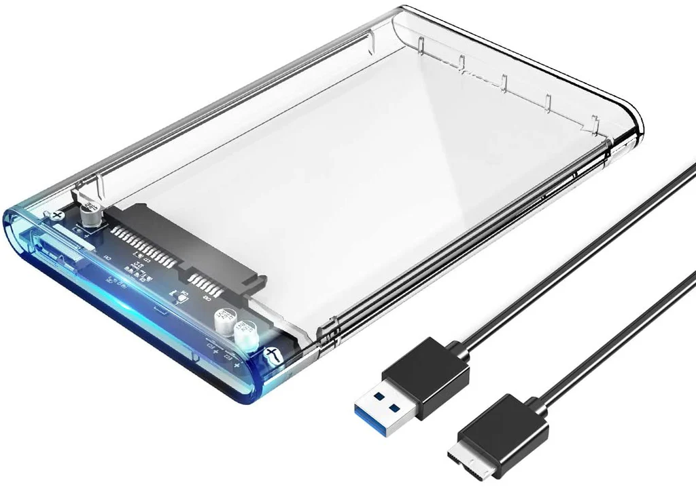
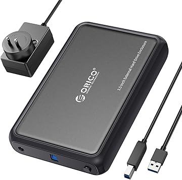

# SPDeedHDD
## Background of Project
I have noticed that there are many adapters that you can purchase, which helps majority of people to connect [SATA](https://en.wikipedia.org/wiki/SATA) Hard Drives and Solid State Drives to USB (3.0) as a mean of external storage, computer rescue, and other miscellaneous purposes.

I have the one as shown below, [Orico USB 3.0 to SATA 2.5 Inch Adapter](https://www.kingly.sg/products/orico-2-5-inch-transparent-hard-drive-enclosure), unfortunately this enclosure only supports 2.5 inch drives, and is only powered of the USB 3.0 bus, which is limited to 5 volts. (For context, 3.5 inch Hard Drives are used in most Desktops, and require a 12 volt supply to operate).

Meanwhile, another type of the drive adapter, [A Orico USB 3.0 to SATA, 3.5 inch](https://www.amazon.sg/ORICO-Enclosure-USB-External-Compatible/dp/B0C2844R2H), which supports 12 volts via an external adapter.

This poses a problem when there are no power slots are available near your workstation, or when someone is down at a worksite, and there is not a power socket available.
## Aim of Project
This project aims to be based on an easily acquirable USB 3.0 to SATA III chipset (not slower than SATA III for usability sake), and uses an industry standard protocol for external power of negotiating power (USB Type C Power Delivery), so that 3.5 inch Hard Drives are able to be powered more readily, by various power sources (USB PD Compliant Power Bricks, or even Power Banks).
## Tasks to be done (Portions of Project)
- ### USB 3.0 (SuperSpeed) to SATA III 
	- [x] Select a USB 3.0 to SATA III Chipset to base project on (ASM1156 chipset)
	- [x] Acquire Sample Schematics, and usages (done)
	- [ ] Make prototype board with debugging headers, without PD in mind yet  (make FW programmable maybe)
	- [ ] After below components are final, make usable prototype
- ### USB PD Power (PPS maybe?)
	- [ ] Look at available USB PD Chips (Adjustable Voltage/Current?)
	- [ ] Get sample schematic (does it need an additional microcontroller?) (or how to let PD controller know we need more power? SATA I/F Failed to init?)
	- [ ] Build up a test circuit ~~(and don't blow myself up)~~
	- [ ] Try and intergrate with bridge chip above (if needed jump to microcontroller)
	- [ ] Reverse voltage/current protection on all power circuit (don't wreck drives and computers for no reason please...)
- ### Microcontroller Bridge? (If needed)
	- [ ] If needed, select a microcontroller to listen in on HDD to bridge chip communication (to determine if drive is fully init'd)
	- [ ] Tie in UART/I2C from bridge chip/PD controller?
	- [ ] Build in a LED (to detemine status of drive, if need external power etc.)
- ### Optional Extras
	- [ ] Support for Molex/IDE HDDs? 
	- [ ] Multiple Interfaces (not only SATA?)
## Gallery
## Support
## Timeline
- 17 March 2024 - Got schematic/design considerations/usage of chip from Asmedia.
- 27 March 2024 - Update README with new information.
